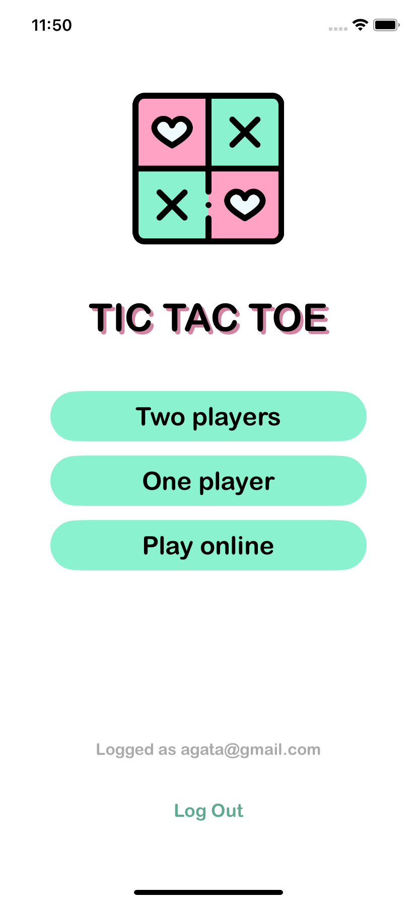
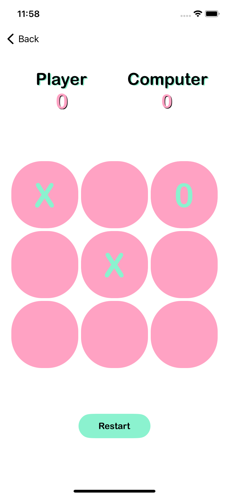

<p align="center">
   <br>
  <h1 align='center' margin-top=0px paddint-top=0px > Tic Tac Toe </h1>
</p>

<p align="center">
Tic Tac Toe game with three game options: two players on one screen, human vs computer using minimax algorithm and online game.
</p>
<br>
<p align="center">

 
</p>
<br>
<p align="center">
<h2 align="center"> Register and login with FireBase Auth. </h2>
</p>
<p align="center">

 
</p>
<br>
<p align="center">
<h2 align="center"> Play with others online </h2>
</p>
<p align="center">

 
</p>
<br>
<p align="center">
<h2 align="center"> Play with your friends on one phone</h2>
</p>
<p align="center">

</p>
<br>
<p align="center">
<h2 align="center"> Try to defeat the algorithm! </h2>
</p>
<p align="center">

 
</p>
<br>

## Requirements
1. [Xcode](https://developer.apple.com/xcode/)
2. [CocoaPods](http://cocoapods.org/)

## Set Up
Clone GitHub repository
```
git clone git@github.com:menescots/TicTacToe.git
```
Install Pods 
```
pod install
```
Open a project 
```
open TicTacToe.xcworkspace
```
Build the project (⌘+B) and check for any errors. <br>
Run the app (⌘+R) and test it.

## License

TicTacToe is under MIT license. See the [LICENSE](LICENSE) file for more info.
